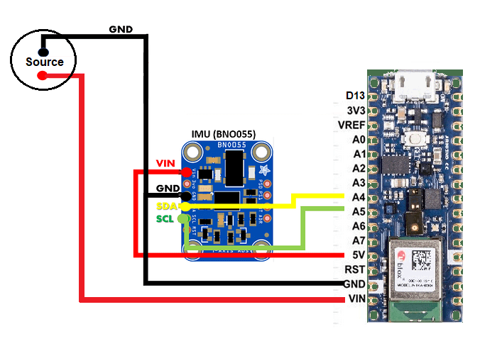

# UC3M-IMU-Position-Tracking
This work presents a test to evaluate the accuracy of the BNO055 IMU sensor integrated with an Arduino board, which transmits its data via Bluetooth to a Python program. The Python program communicates through sockets with the ABB CRB 15000 robot controller to perform automated movements. The test consists of rotating the robot's tool axis in controlled increments of 10 degrees, either about its own axis or along a semicircular path with a radius specified by the operator. The operator can also select the IMU axis (x, y, or z) to measure during the test. The process is fully automated, enabling systematic data collection from the IMU sensor at each movement increment to validate its measurements across all axes.

This repository contains the code and resources for evaluating the accuracy of the BNO055 IMU sensor using an automated system involving an Arduino Nano 33 BLE, a Python program, and an ABB CRB 15000 robot controller.  

## Table of Contents  
- [Overview](#overview)  
- [System Components](#system-components)  
- [Methodology](#methodology)  
- [Requirements](#requirements)  
- [Setup](#setup)  
- [Usage](#usage)  
- [Files and Structure](#files-and-structure)  

---

## Overview  
The project evaluates the angular measurement accuracy of the BNO055 IMU sensor. The robot performs controlled rotational movements, and the IMU captures angular data, which is transmitted and logged for analysis.  

## System Components  
1. **Arduino Code**  
   - Reads IMU data using I2C communication.  
   - Transmits data via Bluetooth to a Python program.  
   - Includes a schematic for connecting the BNO055 sensor to the Arduino Nano 33 BLE.
    
     
   *Figure 1: Connection diagram between Arduino Nano 33 BLE and the BNO055 IMU sensor.*

2. **Python Code**  
   - Manages Bluetooth communication with the Arduino and socket communication with the ABB CRB 15000 robot controller.  
   - Processes user input for trajectory radius and rotation axis.  
   - Logs IMU data in a `.csv` file for analysis.  

3. **RAPID Code**  
   - Controls robot movement based on parameters received via socket.  
   - Executes semi-circular trajectories with tool rotation at 10-degree increments.  

---

## Methodology  
1. Establish Bluetooth communication between the Arduino and the Python program.  
2. Set up a socket connection between the Python program and the robot controller.  
3. Input trajectory parameters (radius and rotation axis) via terminal.  
4. Position the robot at its HOME location.  
5. Calibrate the IMU sensor.  
6. Execute a semi-circular trajectory, recording IMU data at each 10-degree increment.  
7. Save the data in a `.csv` file for analysis.  

---

## Requirements  
- **Hardware**:  
  - Arduino Nano 33 BLE.  
  - BNO055 IMU sensor.  
  - ABB CRB 15000 robot.  

- **Software**:  
  - Python 3.7+  
  - Arduino IDE  
  - RAPID programming environment  

- **Libraries**:  
  - Python: `socket`, `csv`, `bluetooth`  
  - Arduino: `Wire`, `ArduinoBLE`, `Adafruit_BNO055`  

---

## Setup  
1. **Hardware Connections**:  
   - Connect the BNO055 sensor to the Arduino Nano 33 BLE following the provided schematic in the repository.  
2. **Arduino**:  
   - Upload the Arduino code to the Nano 33 BLE.  
3. **Python**:  
   - Install the required Python libraries.  
   - Run the Python script to establish communication with the Arduino and the robot controller.  
4. **Robot**:  
   - Load the RAPID code into the ABB CRB 15000 controller.  

---

## Usage  
1. Power on the Arduino and the robot.  
2. Run the Python script to start communication.  
3. Input the desired trajectory radius and rotation axis in the terminal.  
4. Observe the robot perform the semi-circular trajectory while the IMU data is logged.  
5. Check the `.csv` file for collected data.  

---

## Files and Structure  
root/
├── Arduino_BNO055/
│ └── Arduino_BNO055.ino # Arduino code for IMU data acquisition and Bluetooth 
├── Python_Code/
│ └── code_comunication.py # Python script for communication and data logging
├── RobotStudio_Project/
│ └── Code_Rapid_Main.txt # RAPID code for robot control
│ └── IMU_test.rspag # RAPID project
├── Results_cvs/
│ └── data_X_X_X_X.csv # Logs IMU data in a `.csv` file for analysis.
├── Images/
│ └── schematic.png # Schematic for sensor connections
├── README.md # Project documentation

---

## Contributing  
Feel free to submit issues or pull requests for improvements.  

---

## License  
This project is licensed under the MIT License. See `LICENSE` for more details.  

